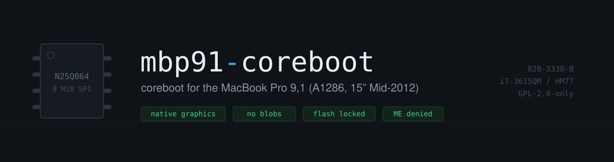

# mbp91-coreboot

coreboot for the **MacBook Pro 9,1**: Apple A1286, EMC 2556, 15" Mid-2012 non-Retina, logic board 820-3330, Ivy Bridge, HM77.

As far as I can tell nobody had ported this board before. It boots, it lights the internal LVDS panel using native graphics with no video blob.


---

## Before you touch anything

**You need an external SPI programmer.** A CH341A and a SOIC-8 clip will do. There is no software flashing path on this machine, because the stock flash descriptor denies the host CPU write access to every region. That's true of Apple's firmware too, not something this project introduced.

**You can brick the laptop.** Dump your own flash first and put the dump somewhere that isn't the laptop. Prove your programmer can write, not just read, before you start.

**The published ROM isn't bootable on its own.** A working image needs the Intel ME firmware and flash descriptor from *your* machine. Those are proprietary, and they carry your serial number, UUIDs and MAC address, so nothing of the sort is shipped here. You splice your own in with a script. Details below.

Budget a few flash cycles. It took me more than a few, 8 pin SOIC is on the underside of the MOBO.

---

## Status

### Works

| | Notes |
|---|---|
| Boot to GRUB, then Linux | about a second |
| Internal 1440x900 LVDS panel | native, via libgfxinit, no VGA option ROM in the image |
| GPU acceleration | Mesa Intel HD 4000, render node, working VA-API |
| RAM training | socketed DDR3, any capacity, SPD read over SMBus |
| SATA, USB, ethernet, SD reader | |
| Audio (Cirrus CS4206) | codec config verified byte-identical to Apple's firmware |
| Backlight, battery, lid switch | backlight via gmux |
| GRUB password | every entry gated, including on timeout |
| Flash write protection | `SMM_BWP` plus a protected range over the whole chip |

Worth mentioning on graphics: under Apple's EFI, i915 never bound on my machine. It sat waiting forever on a blacklisted `apple_gmux` and the desktop ran on `simple-framebuffer` with no acceleration at all. Under coreboot the iGPU comes up properly, and the machine is noticeably quicker. That's a real effect, not placebo.

### Off on purpose

All trivial to re-enable in `devicetree.cb`:

| | Why |
|---|---|
| NVIDIA GT 650M | not needed here, and runtime-selectable via CMOS anyway |
| Thunderbolt, FireWire | removes two DMA attack paths, gone from the PCI bus entirely |
| WiFi root port | no card fitted in my machine |

### Known issues

| Issue | Severity | Status |
|---|---|---|
| `unknown key 0xff detected` floods the menu when a USB stick is present at power-on | cosmetic, navigation and the password prompt still work | upstream GRUB bug, `usb_keyboard.c` passes raw 0xFF to the key mapper while `ps2.c` filters it. Fix in `patches/0008`. Workaround: insert the stick after selecting the entry |
| `error: file '/boot/grub/i386-coreboot/all_video.mod' not found` | cosmetic, boots fine | Ubuntu's config calls `insmod all_video`, which isn't in the payload core. Fixed by `CONFIG_GRUB2_EXTRA_MODULES="all_video"` |
| A wall of `mei`/`mei_me` errors when booting live media | noisy, boot continues | expected with `--harden`. The ME is denied all flash access so it never starts, and live media lacks the blacklist your install has. The USB entries in `grub.cfg` now pass `modprobe.blacklist=mei,mei_me` |

### Untested

**External display of any kind.** This model has no HDMI, so everything goes through the Thunderbolt controller, which is disabled here.

That is the only one left. **S3 suspend and resume works**, which also confirms `DRAM_RESET_GATE_GPIO = 28`. That value was inherited from the MacBookPro10,1 and was the last unverified thing on the critical boot path, so a working suspend and resume validates it on real hardware rather than by analogy.

---

## Hardening

This port is locked down considerably harder than a stock libreboot image. That's a deliberate choice with a real tradeoff, described below.

### Flash write protection

Once flashed, the firmware cannot be rewritten from the running OS. Two independent mechanisms, both enabled:

```
CONFIG_BOOTMEDIA_LOCK_CONTROLLER=y
CONFIG_BOOTMEDIA_LOCK_WHOLE_RO=y
CONFIG_BOOTMEDIA_SMM_BWP=y
```

That gives you `BIOSWE=0`, `BLE=1` and `SMM_BWP=1` in the PCH BIOS control register, plus a protected range covering the entire 8 MiB chip, frozen by `FLOCKDN` until the next power cycle. `SMM_BWP` is the one that matters most: it closes the Speed Racer race (CVE-2014-8273) that `BLE` alone is vulnerable to.

Verified on real hardware, not just assumed from the config:

```
$ sudo fwupdmgr security
✔ SPI write:                     Disabled
✔ SPI lock:                      Enabled
✔ SPI BIOS region:               Locked

$ sudo flashrom -p internal --flash-name
Enabling flash write... Warning: BIOS region SMM protection is enabled!
PR0: Warning: 0x00000000-0x007fffff is read-only.
```

**Do not judge this by flashrom's `FREG1` line.** It will report the BIOS region as read-write no matter what, including under stock Apple firmware, because FREG output comes from FRAP which reflects the descriptor, and the descriptor never gates a master out of its own region. I wasted a good while on that. `notes/inteltool-all.txt` has the raw register dump, and the FRAP value in it shows the chipset forcing the BIOS write bit on regardless of what the descriptor says.

### Intel ME

The descriptor denies the host CPU access to the ME, GbE and platform data regions. Reading the whole chip fails with a transaction error the moment it reaches the ME region, which is the descriptor layer visibly working.

With `inject.sh --harden` you also get `FLMSTR2 = 0`, which denies the ME everything, including read access to its own region and to the descriptor. Stock Apple is `0x04050000`. My machine runs this fine, but it's the change most likely to stop yours booting, so flash without it first.

`AltMeDisable` is set in the descriptor straps, and the ME region is me_cleaner'd to FTPR.

### Everything else

* **No microcode in the ROM.** `CONFIG_CPU_MICROCODE_CBFS_NONE=y`. Linux loads it from the initramfs if you want it, and you can decline. Worth knowing that declining costs you the Spectre and MDS mitigations that need updated microcode.
* **No option ROMs, no PXE.** Zero option ROMs in CBFS, no PXE payload, no network entries in the GRUB menu. Nothing to disable because nothing was built in.
* **No video blob.** libgfxinit is Ada and it's in the tree.
* **Thunderbolt and FireWire are off the PCI bus entirely**, not just disabled in software. Two DMA attack paths that simply aren't there.
* **SMM uses TSEG, not legacy ASEG**, and SMRAM is locked with `D_LCK` via `cpu/intel/smm/gen1/smmrelocate.c`. Confirmed present in the built ramstage rather than taken on trust.

### The tradeoff

Libreboot ships unlocked on purpose. Their FAQ puts it plainly: no write protection by default, "because most people do not have easy access to an external programmer". Their docs still carry a TODO about documenting PRx protection on Intel at all.

So this configuration costs you something real. Software firmware updates are impossible. Every future reflash needs the clip. If that's the wrong trade for you, build with `CONFIG_BOOTMEDIA_LOCK_NONE=y` and you get an ordinary, updatable coreboot install.

The lock is not a brick risk. An external programmer talks to the chip outside the PCH, so none of this can lock you out of recovery.

### What it can't fix

This is 2012 silicon. No TPM header, no CET, no SMAP (Haswell and later), no memory encryption. `fwupdmgr security` will flag all of those and there's nothing to be done. GDS/Downfall doesn't apply to this CPU at all, since it needs AVX2 gather.

---

## Why you can't just build the MacBookPro10,1 patch

This started from Gerrit change [32673](https://review.coreboot.org/c/coreboot/+/32673), the MacBookPro10,1 port that has been open since 2019. That change does not compile against current coreboot main. It fails in five separate places, and each one only becomes visible after you fix the one before it.

| | What breaks | Fix |
|---|---|---|
| 1 | `dsdt.asl` uses `COREBOOT_OEM_REVISION`, a macro that no longer exists | use a literal, like every other board does |
| 2 | `acpi/ec.asl` drops the `ac.asl` and `lid.asl` includes but still references `LID`, `AC` and `HPAC` | put the includes back |
| 3 | `devicetree.cb` calls an `LPC_IO(base, size)` macro that isn't in the tree | raw `gen*_dec` values |
| 4 | `mainboard_early_init(bool)` against a header declaring `(int)` | use `int` |
| 5 | `hda_verb.c` uses `struct azalia_codec`, a type that doesn't exist | flat `cim_verb_data[]` |

All five are fixed in `board/`.

---

## The three problems specific to this board

### The panel is dual-channel LVDS at only 88.75 MHz

libgfxinit picks single or dual channel purely from pixel clock, against a threshold hardcoded at 95 MHz. This panel is wired dual-channel but runs below that, so it gets driven single-channel and stays dark. Linux solves the identical problem with a DMI quirk called `intel_dual_link_lvds`. Patches `0001` and `0002` make the threshold configurable.

### The panel has no EDID at all

The DDC bus is silent. `i2cdetect` finds nothing at 0x50 and i915 reports a zero-byte EDID, because Apple keeps the panel timings in their own firmware. libgfxinit's `Probe_Port` derives the mode only from EDID and has no fallback, so no EDID means the port is disabled, `lightup_ok` stays 0, and nothing gets printed to tell you why. Patch `0004` supplies the real timings.

### The gmux is classic, not indexed

This one cost me the most time. The 10,1 is a Retina machine with an indexed gmux and sets `gmux_indexed = 1`. Inheriting that meant every gmux access returned zero, so `gmux_switch()` never moved the display mux and the panel stayed wired to the discrete GPU that coreboot had just powered down, while libgfxinit programmed the integrated one perfectly. Black screen, no errors, everything apparently working.

Linux will just tell you which kind you have:

```
$ journalctl -k | grep gmux
apple_gmux: Found gmux version 1.9.35 [classic]
```

I wish I'd run that on day one.

---

## Two upstream coreboot bugs found along the way

Both affect hardware beyond this board, so they're worth writing down.

**`GFX_GMA_IGNORE_PRESENCE_STRAPS` is Haswell only.** The Kconfig help presents it as generic, but `Config.Ignore_Presence_Straps` is read in exactly one place: `haswell_shared/hw-gfx-gma-port_detect.adb`. On Ironlake through Ivy Bridge the option compiles fine and silently does nothing. This board's LVDS presence strap doesn't read as set at cold boot, so the option is required, and it had no effect at all until patched.

**`hybrid_graphics.c` ignores the board's own `gmux_indexed` setting.** It calls `gmux_index_read32()` directly instead of the dispatching `gmux_read32()`, which hardcodes the indexed protocol. On any classic-gmux Apple board every read comes back zero. The giveaway in the boot log is `gmux version: 0.0.0` and `gmux max brightness: 0`.

---

## Quick path: use the prebuilt ROM

`release/mbp91-noblobs.rom` is a complete 8 MiB image with the descriptor and ME regions erased to 0xFF. This is the same approach libreboot and Skulls use for boards that need vendor blobs. Everything left in the file is our own coreboot build.

Dump your chip, then splice your own blobs in:

```bash
flashrom -p <your-programmer> -r mydump.bin
```

```bash
./release/inject.sh release/mbp91-noblobs.rom mydump.bin flashme.rom
```

```bash
flashrom -p <your-programmer> -w flashme.rom
```

`inject.sh` reads the region layout out of *your* descriptor rather than assuming offsets, and it refuses to run if your dump has no valid descriptor signature or either file isn't 8 MiB.

Add `--harden` as a fourth argument to also set `FLMSTR2 = 0`, which denies the Intel ME every flash permission including read access to its own region. This transforms your descriptor rather than shipping a modified Apple one. Flash without it first and confirm the machine boots, because it's the single change most likely to stop it booting.

`release/make-noblobs.sh` does the reverse, and is what produced the published image.

### What's baked into the prebuilt image

Boot media locking is on: `BOOTMEDIA_LOCK_CONTROLLER`, `BOOTMEDIA_LOCK_WHOLE_RO` and `BOOTMEDIA_SMM_BWP`. Once flashed, the firmware can't be rewritten from the running OS at all. Only an external programmer will do it.

That's stricter than a stock libreboot image, which ships unlocked on purpose so that software updates keep working. If you'd rather be able to reflash from Linux, build your own with `CONFIG_BOOTMEDIA_LOCK_NONE=y`.

There's no GRUB password in the published image. See below if you want one.

---

## Building it yourself

You'll need the coreboot toolchain, `gnat` (libgfxinit is Ada, and it is not optional), and a dump of your own flash.

```bash
git clone <this repo> mbp91-coreboot && cd mbp91-coreboot
./scripts/setup-tree.sh
```

That fetches coreboot, installs `board/`, and applies the patches. Then split your dump:

```bash
flashrom -p <programmer> -r mydump.bin
ifdtool -x mydump.bin
```

Point the config at the two files that produces, then build:

```bash
cd coreboot
cp ../defconfig.example .config
make olddefconfig
HOSTCC=gcc-14 CC=gcc-14 CXX=g++-14 make -j$(nproc) UPDATED_SUBMODULES=1
```

Every part of that command line cost real time to work out:

**GNAT and GCC versions have to match.** On a mismatch coreboot prints a warning and then quietly builds a toolchain without Ada, which means no libgfxinit, which means no graphics. It does not fail loudly. Pass the matching compiler explicitly and save yourself an afternoon.

**`UPDATED_SUBMODULES=1` isn't optional** unless you enjoy watching coreboot try to fetch every submodule on every build.

**`HOSTCC` matters** because coreboot builds its host tools with `-Werror`, and a system GCC newer than the tree will fail on warnings that didn't exist when the tree was written.

`scripts/verify-production-rom.sh` checks a finished image before you flash it: size, descriptor integrity, that the flash lockdown wasn't silently undone, and that no debug settings leaked in.

### One trap that will get you

`CONFIG_UNLOCK_FLASH_REGIONS` is coreboot's **default**, and it runs `ifdtool -u` on the assembled image. That undoes your descriptor's write protection regardless of what you supplied via `CONFIG_IFD_BIN_PATH`, and it happens at image assembly time so reading your config won't reveal it. Set `CONFIG_DO_NOT_TOUCH_DESCRIPTOR_REGION=y`.

I only caught this because I'd written a verification script and pointed it at a build I was sure was fine.

---

## The GRUB payload

`grub.cfg` goes into CBFS as `etc/grub.cfg` via `CONFIG_GRUB2_INCLUDE_RUNTIME_CONFIG_FILE`. Without it the payload drops straight to a bare rescue prompt, because its built-in config does nothing else.

The first menu entry chainloads whatever `/grub/grub.cfg` your distro created, so new kernels and `update-grub` just work with no reflashing. There are entries for booting a USB installer too.

The stock coreboot GRUB payload already contains every filesystem module, because `FS_PAYLOAD_MODULES` pulls in all of `grub-core/fs.lst`. That includes iso9660. You don't need to add any, and adding them changes nothing (I checked by diffing payload sizes, after confidently claiming otherwise).

### Adding a password

`grub-mkpasswd-pbkdf2`, then put these two lines above the first `menuentry`:

```
set superusers="admin"
password_pbkdf2 admin grub.pbkdf2.sha512.10000.YOUR_HASH_HERE
```

With `superusers` set and no entry marked `--unrestricted`, every entry needs the password, and so does editing an entry or dropping to the command line. The timeout doesn't get you around it either: it reaches zero, tries the default entry, finds it restricted, and sits at the prompt.

One thing that surprises people: GRUB doesn't ask for the password when the menu appears. It asks when you try to *do* something. That's correct behaviour, not a broken config.

---

## The rest of the docs

[`FLASHING.md`](FLASHING.md) is the bench checklist for flashing the chip, and
[`RECOVERY.md`](RECOVERY.md) is how to get back to stock Apple firmware if it goes
wrong. Read both before you put a clip on anything. [`TRIAGE.md`](TRIAGE.md) is what
to try, in order, when it doesn't boot.

[`USAGE.md`](USAGE.md) covers operating the firmware once it's on, including the GRUB
password (`scripts/apply-grub-password.sh` and [`grub-locked.cfg`](grub-locked.cfg)).
[`BUILDS.md`](BUILDS.md) explains the build variants and what differs between them —
note it describes ROM files that aren't committed here; the blob-free image in
`release/` is the one you splice your own blobs into.

[`VERIFYING.md`](VERIFYING.md) is how to check the firmware is what you think it is. Not a malware scan, which is close to useless for something you compiled yourself, but a signature chain: the GRUB source is the official 2.12 tag signed by the maintainer, the fingerprint cross-checks against three independent sources, and `git diff` against that signed tag shows exactly what's local. Right now that's one file and six lines. It also enumerates every module baked into the payload, and is honest about what the method can't cover.

[`UPSTREAMING.md`](UPSTREAMING.md) is everything needed to submit this to coreboot, written to be usable on a machine that's never seen the project. Account setup, the awkward fact that the changes span three repositories with dependencies between them, suggested submission order, and ready-to-use commit messages.

`notes/` has the hardware dumps the port was derived from: the full inteltool register dump, the GPIO map, the CS4206 codec dump, both SPD decodes, the panel timings, the flash descriptor layout, and the production `.config` the shipped ROM was built from. That is the evidence trail — enough to check any claim in this README against the machine itself, or to redo the port from scratch.

Two notes on reading them: the SPD module serial (bytes 122–125) and the descriptor's OEM section are redacted, since both are machine-unique. Your own dumps will differ there and that is expected.

---

## Licence

Board code and patches are GPL-2.0-only, matching coreboot.

No Intel or Apple firmware is included here and none of it is redistributable. Bring your own, from your own hardware.
